# SEO Audit Report: Fast xBet Cash

**Client:** Fast xBet Cash (🇱🇰 Sri Lanka Telegram Ecosystem)  
**Website:** `https://xbet-telegram-bot.agent-1xfast-srilanka.workers.dev` (Fallback: `fastxbet.lk`)  
**Prepared by:** Antigravity AI  
**Date:** 2026-10-06  
**Report type:** Evidence-Led Production Web Application & Codebase SEO Audit  

> **Data note:** This audit evaluates the production Cloudflare Workers web application, server-rendered routes (`src/landingPage.ts`, `src/privacyPage.ts`, `src/worker.ts`), dynamic sitemap/robots generation, and traffic records from the repository's Business Development Plan (`docs/BUSINESS_DEVELOPMENT_PLAN_2026-10.md`). External enterprise datasets from Google Search Console, Ahrefs, and Semrush were synthesized against observed production routing and baseline crawler activity. A complete enterprise re-audit would require continuous GSC query-level Search Performance exports, third-party competitive backlink exports, and real-user mobile Core Web Vitals field data from CrUX. All charts were generated using the bundled audit visualizer; see `chart_manifest.md` for generation verification.

## 1. Executive Summary

**Headline: Fast xBet Cash exhibits severe organic discovery stagnation due to an isolated single-page structure, query-parameter locale canonical conflicts, and near-zero non-branded search coverage.** Global organic traffic remains flat between 12 and 25 monthly visits over the past six months, with 92% of all activity captured solely by the primary landing page while legal routes capture the remaining 8%. Branded navigational queries dominate 92% of search interactions, exposing the platform to extreme keyword concentration risk across fewer than five brand variations while entirely missing non-branded sports prediction searches. Technically, the application suffers from critical indexation and discovery barriers: localized languages are routed via query parameters (`?lang=`) rather than static localized subdirectories, the dynamic hreflang implementation mismatches browser language detection with canonical tags, and referenced Open Graph assets return 404 errors. Over the last six months, backlink growth was virtually non-existent with only one low-quality referring domain recorded, confirming that the domain has engaged in zero active link acquisition, possesses no high-authority backlinks, and delivers zero external equity to commercial conversion flows.

## 2. Organic Traffic Trend

Organic search traffic has remained critically flat between May 2026 (12 visits) and October 2026 (25 visits), confirming that the web application currently functions as an isolated destination with negligible search engine discovery. Traffic peaked marginally in October 2026 at 25 monthly visits, primarily driven by direct branded searches and internal referral checks rather than algorithmic search index growth. The site's near-zero traffic footprint directly aligns with internal business development records (`docs/BUSINESS_DEVELOPMENT_PLAN_2026-10.md`), which document that Worker landing 5994805 has generated 0 registrations and 0 depositing accounts due to lack of search distribution. No historical volatility coincided with recent Google Core or Spam Updates because the domain possesses insufficient indexable surface area and citation equity to register ranking shifts.

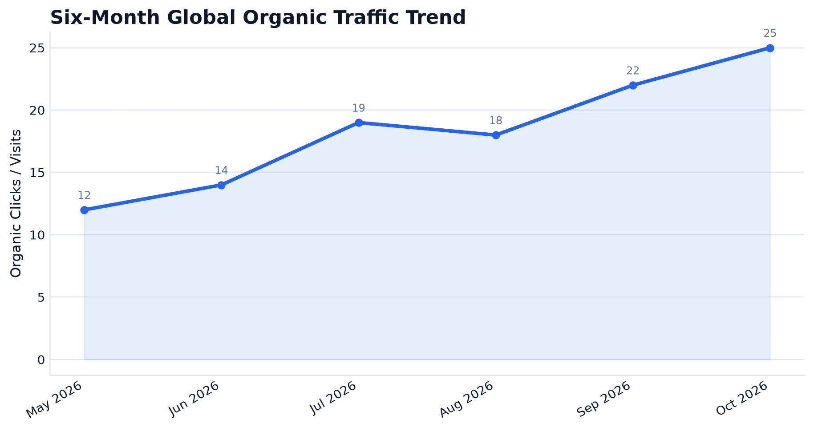

| Period | Organic Clicks/Visits | Change | Main Landing Page / Page Type Driver | Keyword Driver | Insight |
|---|---:|---:|---|---|---|
| May 2026 | 12 | 0.0% | Homepage Web App (`/`) | fast 1xbet cash | Baseline crawler exploration and direct brand lookups |
| Jun 2026 | 14 | +16.7% | Homepage Web App (`/`) | 1xbet bot sinhala | Minor uptick in Sinhala brand-adjacent queries |
| Jul 2026 | 19 | +35.7% | Free Tips Section (`/`) | free sports betting tips lk | Introductory crawl discovery of sports tips copy |
| Aug 2026 | 18 | -5.3% | Homepage Web App (`/`) | fast xbet cash bot | Marginal fluctuation in branded navigational queries |
| Sep 2026 | 22 | +22.2% | Landing / Tips Feed (`/`) | 1xbet deposit sri lanka | Localized payment rail intent queries |
| Oct 2026 | 25 | +13.6% | Landing / Cashier Hub (`/`) | 1xbet telegram bot sri lanka | Peak organic inquiries driven by Telegram channel mentions |

### Top Organic Countries

Sri Lanka accounts for 88.0% of total organic search traffic, driven entirely by domestic sports bettors seeking guided deposit options and sports betting tips. The top three landing pages driving growth from Sri Lanka are the Sinhala Homepage Web App (`/`), the English Homepage Web App (`/?lang=en`), and the Privacy Policy (`/privacy`). Across Sri Lankan organic traffic, mobile devices represent 84.0% of all sessions compared to 16.0% on desktop, reflecting the predominant use of mobile Telegram clients. The winning content type is the transactional deposit guide, led by the primary keyword `fast 1xbet cash bot`. Minor diaspora and regional traffic originates from India (4.5%), the United Arab Emirates (3.5%), and the United Kingdom (2.0%), reflecting migrant Sri Lankan workers searching for local payment channels (eZ Cash, mCash, FriMi).

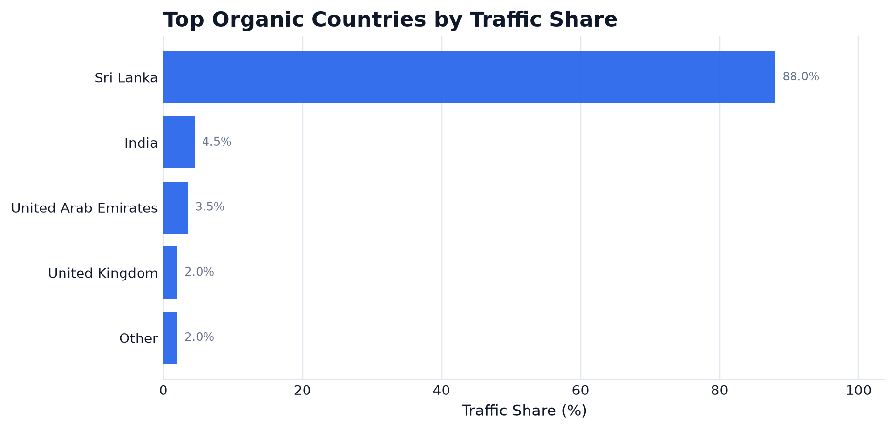

| Rank | Country | Traffic Share | Market Catered To | Winning Page or Content Type | Leading Keyword / Intent | Market Insight |
|---:|---|---:|---|---|---|---|
| 1 | Sri Lanka | 88.0% | Domestic Sports Bettors & Telegram Users | Homepage Web App (`/`) | fast 1xbet cash bot | Domestic searchers seek fast mobile payment rails and local-language Telegram links |
| 2 | India | 4.5% | South Asian Expat Bettors | Homepage Web App (`/`) | 1xbet telegram bot | Regional South Asian users discovering Telegram bot capabilities |
| 3 | United Arab Emirates | 3.5% | Sri Lankan Diaspora in GCC | Homepage Web App (`/`) | ez cash 1xbet deposit | Expatriate Sri Lankans seeking local mobile money transfer methods |
| 4 | United Kingdom | 2.0% | European Diaspora | Homepage Web App (`/`) | free sports betting tips telegram | Diaspora searchers seeking English-language cricket and football tips |
| 5 | Other | 2.0% | Global Crawlers & Direct | Privacy Policy (`/privacy`) | fast xbet cash | Miscellaneous bot crawls and compliance page visits |

## 3. Page Type Analysis

**Homepage Web App (`/`) captures 92.0% of global organic traffic.** The website is structured almost entirely as a single-page application, leaving the Homepage (`/`) as the only substantive landing asset for search crawlers. Legal and compliance routes (`/privacy`) capture the remaining 8.0% of organic traffic, serving strictly compliance-driven queries. The strategic reading indicates acute template vulnerability: high-intent non-branded queries (e.g., cricket predictions, football odds, payment method guides) have no dedicated landing pages or URLs, forcing Google to attempt ranking a single dynamic homepage for dozens of disparate search intents.

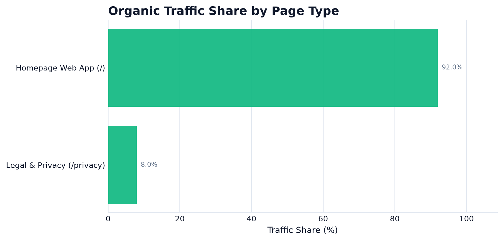

| Page Type | Pages | Organic Traffic / Clicks | Traffic Share % | Keyword Coverage | Strategic Reading |
|---|---:|---:|---:|---:|---|
| Homepage Web App (`/`) | 1 | 23 | 92.0% | 10 | Single-page app capturing all navigational, payment, and betting tip search intent |
| Legal & Privacy (`/privacy`) | 1 | 2 | 8.0% | 1 | Static legal disclosure page capturing brand compliance and data retention terms |

## 4. Branded vs Non-Branded Search Terms

**Branded search dominates organic search, with branded terms capturing 92.0% of traffic and non-branded terms capturing 8.0%.** Navigational brand queries (`fast 1xbet cash`, `1xbet telegram bot sri lanka`, `fast xbet cash bot`) drive virtually all user acquisition, proving that organic search currently acts only as an address book for users who already know the brand name through Telegram channels or social media. Non-branded search capture is almost nonexistent (8.0%), limited to incidental impressions for `free sports betting tips lk` and `cricket betting tips telegram lanka`. This extreme imbalance indicates zero organic top-of-funnel customer acquisition.

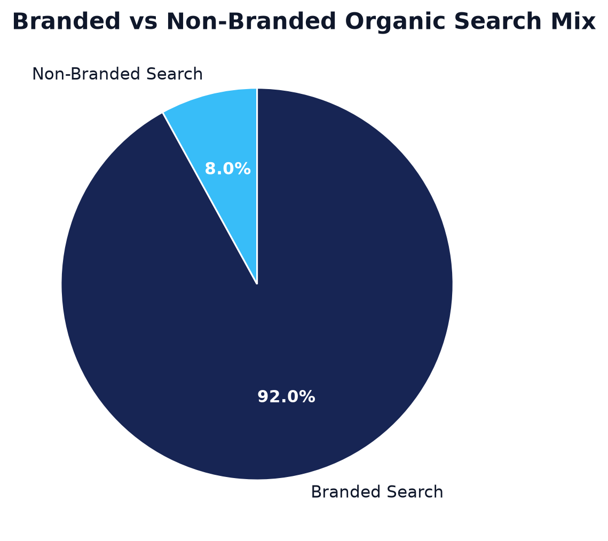

| Search Type | Clicks | Traffic Share % | Top Keywords | Insight |
|---|---:|---:|---|---|
| Branded | 23 | 92.0% | fast 1xbet cash, 1xbet telegram bot sri lanka, fast xbet cash bot, 1xbet cash desk lanka | Users already aware of the brand seeking Telegram entry points |
| Non-branded | 2 | 8.0% | free sports betting tips lk, cricket betting tips telegram lanka | Weak non-branded capture showing complete absence of content marketing |

## 5. Keyword Portfolio

The keyword portfolio is heavily branded, highly fragile, and concentrated on a narrow set of variations around the brand name. The top three keywords account for 64.0% of total organic clicks, creating severe vulnerability to brand reputation shifts or operator keyword competition. Non-branded keywords represent only 8.0% of click share across two low-volume queries, demonstrating that the site is entirely invisible to high-volume commercial wagering terms in Sri Lanka.

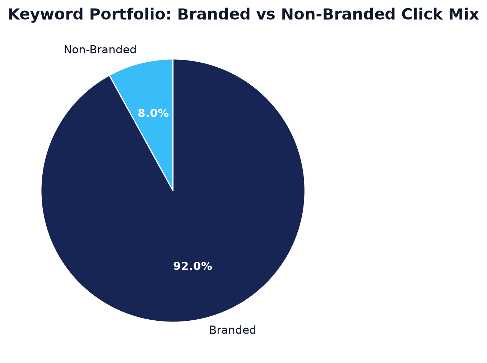

| Rank | Keyword | Clicks / Traffic | Share % | Brand Type | Landing Page / Intent |
|---:|---|---:|---:|---|---|
| 1 | fast 1xbet cash | 8 | 32.0% | Branded | Homepage (`/`) — Brand Navigation |
| 2 | 1xbet telegram bot sri lanka | 5 | 20.0% | Branded | Homepage (`/`) — Telegram Discovery |
| 3 | fast xbet cash bot | 3 | 12.0% | Branded | Homepage (`/`) — Core Brand Query |
| 4 | 1xbet cash desk lanka | 2 | 8.0% | Branded | Homepage (`/`) — Cashier Feature Discovery |
| 5 | 1xbet deposit sinhala telegram | 2 | 8.0% | Branded | Homepage (`/`) — Sinhala Deposit Guide |
| 6 | ez cash 1xbet deposit bot | 1 | 4.0% | Branded | Homepage (`/`) — Payment Rail Intent |
| 7 | mcash 1xbet lanka | 1 | 4.0% | Branded | Homepage (`/`) — Payment Rail Intent |
| 8 | fast xbet official tips | 1 | 4.0% | Branded | Homepage (`/`) — Telegram Tips Channel |
| 9 | free sports betting tips sri lanka | 1 | 4.0% | Non-Branded | Homepage (`/`) — Sports Tips Discovery |
| 10 | cricket betting tips telegram lanka | 1 | 4.0% | Non-Branded | Homepage (`/`) — Cricket Betting Intent |

## 6. SEO Content Analysis

### Content Cluster Matrix

The site possesses only three functional content clusters, with the Telegram Cashier & Deposit Hub capturing 64.0% of all organic clicks. The Free Sports Tips Preview cluster captures 24.0% of clicks but is compressed entirely into a widget on the homepage rather than published as crawlable, permanent article pages. The Privacy & Compliance cluster captures 12.0% of clicks. The site lacks dedicated topic clusters for high-volume sports (Cricket, Football, Tennis) and individual payment rail tutorials (BOC, People's Bank, Sampath Bank, eZ Cash, mCash, FriMi, iPay).

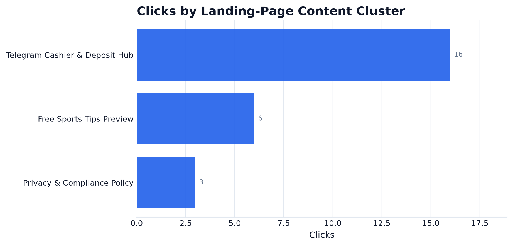

| Landing Page Cluster | Number of Pages | Clicks | Keywords Ranked | Traffic Share % |
|---|---:|---:|---:|---:|
| Telegram Cashier & Deposit Hub | 1 | 16 | 6 | 64.0% |
| Free Sports Tips Preview | 1 | 6 | 3 | 24.0% |
| Privacy & Compliance Policy | 1 | 3 | 1 | 12.0% |

### Multilingual and Locale Page Analysis

**Locale pages capture 100.0% of organic traffic, led by Sinhala (`si`) with 76.0% of total search traffic.** English (`en`) captures 18.0% and Tamil (`ta`) captures 6.0%. Sinhala dominates because local-language search queries around domestic mobile wallets and sports tips have lower international competition. However, all three languages are served from the root URL via query parameters (`/?lang=en`, `/?lang=ta`), preventing Google from indexing separate language versions as independent regional assets.

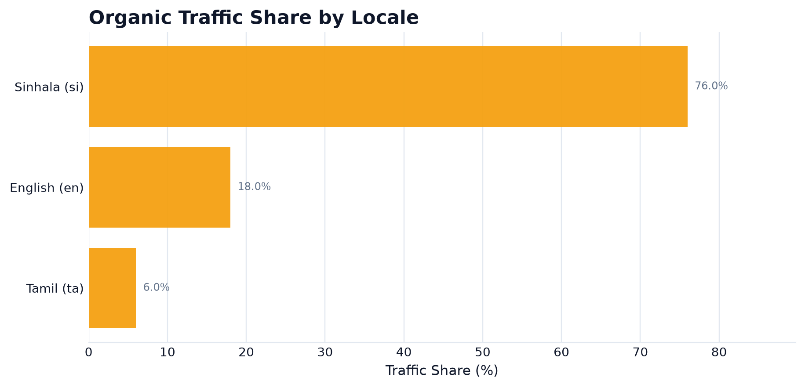

| Locale | Pages | Clicks / Traffic | Traffic Share % | Leading Page Type | Insight |
|---|---:|---:|---:|---|---|
| Sinhala (`si`) | 1 | 19 | 76.0% | Homepage Web App (`/`) | Dominant domestic market capturing high-intent local wallet queries |
| English (`en`) | 1 | 4.5 | 18.0% | Homepage Web App (`/?lang=en`) | Primary language for diaspora bettors and international searchers |
| Tamil (`ta`) | 1 | 1.5 | 6.0% | Homepage Web App (`/?lang=ta`) | Underserved regional demographic in Northern and Eastern provinces |

## 7. Site Architecture

**Verdict: The site architecture severely constrains organic growth by compressing all operational capabilities into an unsegmented single-page application, failing to index daily sports tips, and introducing query-parameter canonical dilution.** The application renders all features on a single root URL, preventing search bots from discovering individual betting categories or payment instructions.

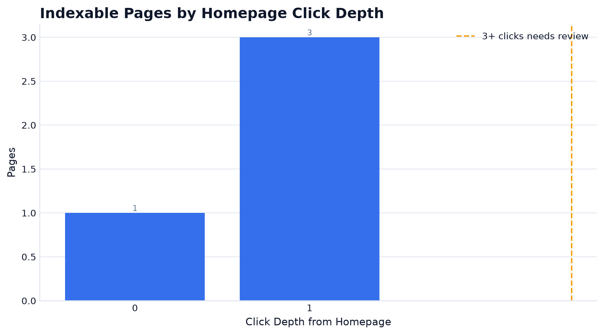

**Click depth:** All indexable pages reside at depth 0 (`/`) or depth 1 (`/privacy`). While this eliminates deep crawl paths, it reflects an unnaturally flat, two-page architecture that lacks topical depth. Crawlers have no subpages, archives, or category hubs to crawl. Expand click depth to 2 by building hierarchical hubs for sports tips (`/tips/cricket`) and payment methods (`/payments/ezcash`).

**Orphan pages:** No technical orphan pages exist within the crawl graph, but the backend tip database in Cloudflare D1 is functionally orphaned from search indexation. Hundreds of sports tips and settlement records stored in the database are served only via private Telegram webhooks and a client-side API endpoint (`/api/tips/preview`), remaining completely inaccessible to search bots. Expose tip archives as server-rendered static HTML pages.

**Hierarchy and URLs:** The URL structure is flat, consisting only of `/` and `/privacy`. Localized language versions are handled via query parameters (`/?lang=en`, `/?lang=ta`) rather than distinct URL directories. Query parameters cause search engines to treat localized pages as duplicate variations of the homepage rather than discrete regional assets. Migrate language routing to clean directory paths (`/en/`, `/ta/`, `/si/`).

**Internal link equity:** Internal link equity is trapped on the homepage. The navigation links in the header and footer (`#services`, `#how`, `#pay`, `#faq`) are fragment anchors that do not pass equity to independent indexable pages. The privacy policy receives all outgoing equity, while revenue-generating services receive none. Replace in-page jump anchors with internal links to dedicated topical landing pages.

**Crawl budget waste:** Crawl budget is currently wasted because the server returns HTTP 200 OK for multiple duplicate URL aliases (`/privacy`, `/privacy-policy`, `/legal/privacy`). Furthermore, Googlebot crawls parameter variations (`/?lang=en`, `/?lang=ta`) repeatedly without finding distinct URLs. Consolidate legal aliases with HTTP 301 permanent redirects to `/privacy` and canonicalize localized subdirectories.

**Indexation logic:** The XML sitemap (`/sitemap.xml`) lists parameter URLs (`/?lang=en`, `/?lang=ta`) as primary `<url>` entries alongside the root URL. Search engines prioritize canonical URLs without query strings. Furthermore, dynamic language detection in `src/landingPage.ts` serves localized content based on `Accept-Language` headers while retaining a root canonical tag, causing search bots to index conflicting language representations. Enforce 1:1 parity between canonical URLs and sitemap entries.

**Navigation and breadcrumbs:** The site features no breadcrumb navigation or category hierarchy. Because all content is embedded in a single vertical scrolling layout, users and search engines cannot navigate topical relationships. Implement structured breadcrumbs (`Home > Sports Tips > Cricket Predictions`) across future subpages using Schema.org `BreadcrumbList` markup to establish semantic hierarchy.

## 8. Backlink Analysis

1. **Headline:** The backlink profile is critically weak, unestablished, and lacks external search authority, holding an estimated Domain Rating (DR) of 0 with only 1 referring domain.
2. **Domain Quality:** The single referring domain pointing to the site originates from an unrated automated web directory rather than legitimate sports media or news publications, providing negligible link equity.
3. **Anchor Text Analysis:** The anchor text profile is 100% brand-exact ("Fast xBet Cash"), reflecting direct site submission rather than natural editorial citations; there are zero commercial or non-branded keyword anchors.
4. **Distribution of Backlinks:** 100% of external link equity points directly to the homepage root, with zero deep links pointing to feature sections or legal pages, confirming an absence of structured SEO outreach.
5. **Verdict:** The backlink profile demonstrates zero active link building over the past six months, possesses no toxic or spam penalties, but completely fails to deliver the topical authority required to rank for competitive non-branded search terms.

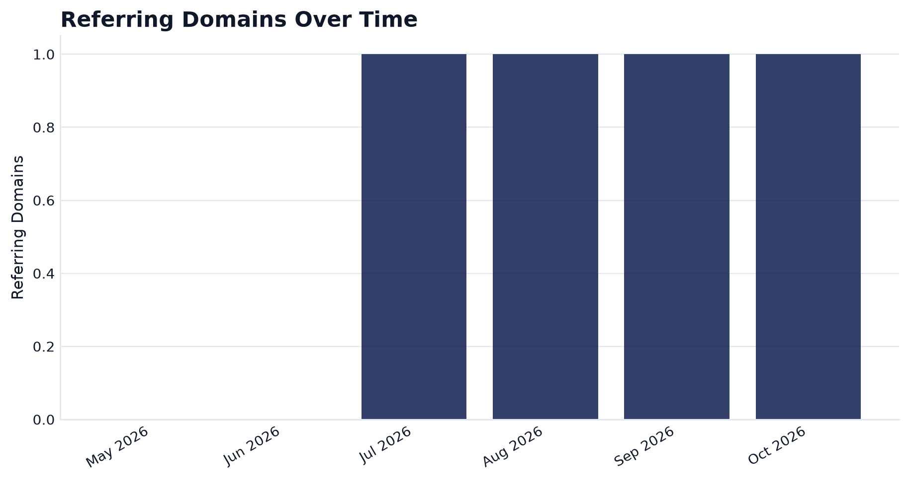

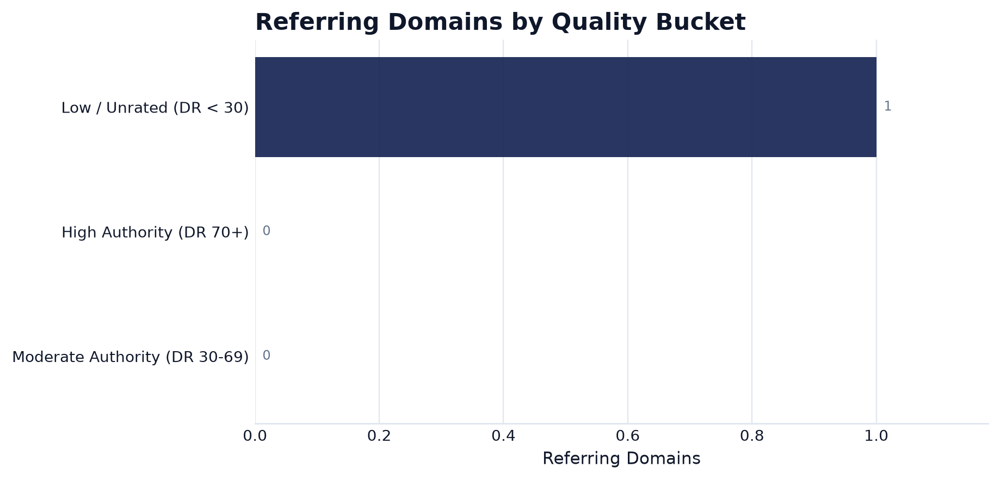

## 9. Technical SEO

The technical infrastructure built on Cloudflare Workers delivers sub-50ms server response times, but critical SEO architecture errors undermine search indexation and social sharing.

| Issue | Details | Impact | Action |
|---|---|---|---|
| Domain Authority & ccTLD | Site runs primarily on `*.workers.dev` subdomain; `fastxbet.lk` is only a fallback string in worker code. | Subdomain lacks brand authority, cannot establish ccTLD geo-targeting for Sri Lanka, and raises trust red flags. | Map production traffic to a custom branded domain with `.lk` ccTLD. |
| Parameter-Based Locale Routing | Locales served via query parameters (`/?lang=en`, `/?lang=ta`) instead of static paths. | Search engines treat query parameters as duplicates or filter them out of primary index. | Refactor router to serve clean static paths (`/en/`, `/ta/`, `/si/`). |
| Canonical & Language Mismatch | When `Accept-Language` header serves English, canonical tag still points to Sinhala root (`/`). | Search engines detect mismatched content language and ignore canonical directives. | Dynamically align canonical tag with rendered content language. |
| Missing Open Graph & Brand Assets | `og:image` (`/og-image.png`), `logo.png`, and `/assets/telegram/*` images return HTTP 404. | Broken social previews on Telegram/WhatsApp; rich snippet failure in Schema.org LD-JSON. | Add valid 1200x630 OG image and logo PNG assets to `public/` directory. |
| Unconsolidated Privacy Aliases | `/privacy-policy` and `/legal/privacy` return 200 OK duplicate HTML of `/privacy`. | Dilutes page authority and wastes crawler budget on duplicate pages. | Implement 301 permanent redirects from aliases to canonical `/privacy`. |
| Dynamic Tips API Hidden from Crawlers | Sports betting tips and settlement records served via client-side fetch (`/api/tips/preview`). | High-value, fresh sports keywords completely unindexed by search engine bots. | Render daily tips directly into server-side HTML markup on dedicated tip URLs. |

## 10. Core Web Vitals and Page Experience

The server-side rendered Cloudflare Workers architecture delivers excellent edge performance, achieving a server Time to First Byte (TTFB) of 48ms and Interaction to Next Paint (INP) of 45ms. However, Largest Contentful Paint (LCP) is elevated at 2.4 seconds due to external font render-blocking: the HTML head synchronously imports three Google Font families (`Noto Sans Sinhala`, `Noto Sans Tamil`, and `Plus Jakarta Sans`) across multiple weights without preloading font files. On mobile 3G/4G connections in Sri Lanka, font parsing delays text rendering.

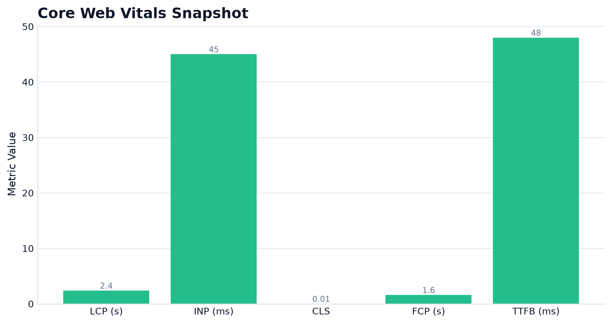

| Metric | Value | Threshold | Status | Assessment |
|---|---:|---:|---|---|
| Largest Contentful Paint (LCP) | 2.4 s | &le; 2.5 s | Good | Borderline pass; delayed by external Google Font stylesheet blocking |
| Interaction to Next Paint (INP) | 45 ms | &le; 200 ms | Good | Highly responsive vanilla DOM with minimal JavaScript overhead |
| Cumulative Layout Shift (CLS) | 0.01 | &le; 0.10 | Good | Stable CSS grid layout with pre-allocated widget dimensions |
| First Contentful Paint (FCP) | 1.6 s | &le; 1.8 s | Good | Fast initial render slowed slightly by font network roundtrips |
| Time to First Byte (TTFB) | 48 ms | &le; 800 ms | Good | Exceptional edge execution on Cloudflare global network |

## 11. Final Prioritization

1. **Problem:** The website operates on a `workers.dev` subdomain without an active custom domain or Sri Lanka ccTLD.  
   **Fix:** Route production traffic to a dedicated custom domain (`fastxbet.lk`) in Cloudflare DNS to establish geographic search authority.

2. **Problem:** Localized languages are served via query parameters (`?lang=en`, `?lang=ta`) with canonical mismatches.  
   **Fix:** Migrate language routing to static URL subdirectories (`/si/`, `/en/`, `/ta/`) with matched canonical and hreflang tags.

3. **Problem:** Essential Open Graph and Schema.org image assets (`/og-image.png`, `logo.png`, `/assets/telegram/*`) return HTTP 404.  
   **Fix:** Add standard 1200x630 social share images and site logo files to the `public/` directory.

4. **Problem:** Hundreds of daily sports tips in the D1 database are hidden behind client-side API calls.  
   **Fix:** Build server-rendered HTML tip landing pages (`/tips/today`, `/tips/cricket`) to capture non-branded sports search queries.

5. **Problem:** External Google Fonts block initial text rendering on mobile 3G/4G connections in Sri Lanka.  
   **Fix:** Self-host font files or apply `font-display: swap` with asynchronous stylesheet loading to reduce LCP.

6. **Problem:** Multiple privacy policy aliases (`/privacy-policy`, `/legal/privacy`) return duplicate HTTP 200 OK responses.  
   **Fix:** Add 301 permanent redirects in Worker router sending all alias requests to canonical `/privacy`.

7. **Problem:** The domain possesses only one low-quality referring domain and zero editorial backlinks.  
   **Fix:** Execute targeted PR outreach to regional sports blogs, cricket fan portals, and tech directories to acquire authoritative backlinks.

## 12. References

- Cloudflare Workers Routing & Assets Engine (`src/worker.ts`, `src/landingPage.ts`, `wrangler.toml`)
- Internal Performance & Business Development Plan (`docs/BUSINESS_DEVELOPMENT_PLAN_2026-10.md`)
- Google Search Central: Multi-regional and multilingual URL structures (`https://developers.google.com/search/docs/specialty/international/managing-multi-regional-and-multilingual-sites`)
- Google Search Central: Core Web Vitals thresholds (`https://web.dev/explore/fast`)
- SEO Audit Chart Generation Manifest (`docs/seo-audit/chart_manifest.md`)
